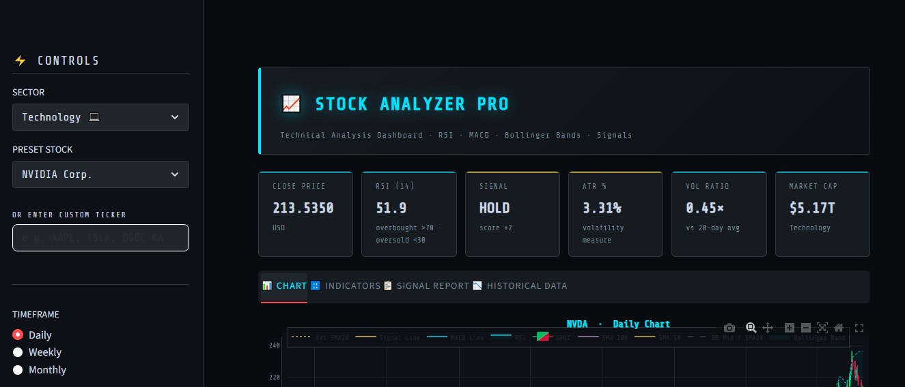
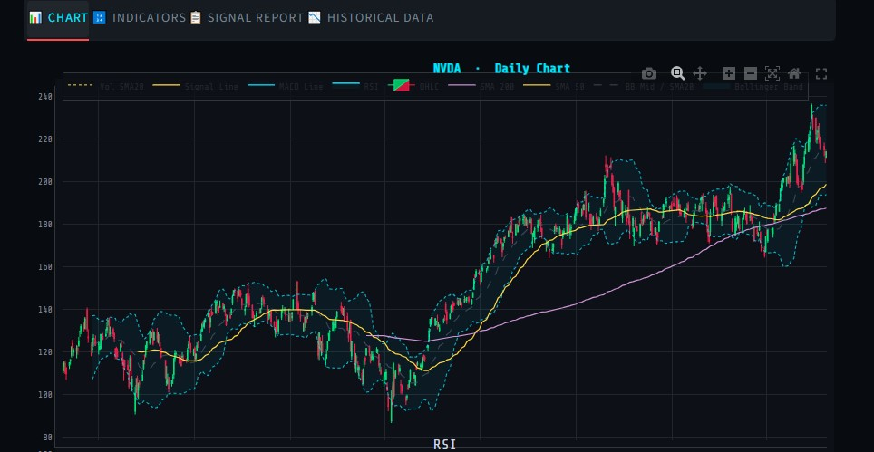
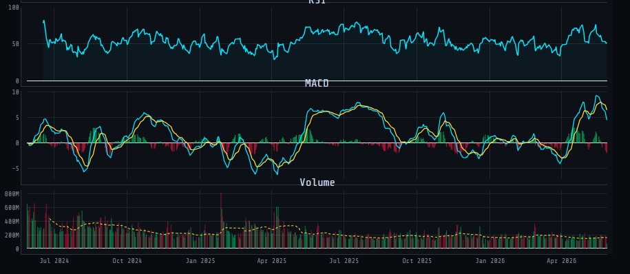

# Stock Price Analyzer

A Python tool to fetch live and historical stock data, run basic statistical analysis,
and generate clean visualisations - all from the command line.
Built with Python, yfinance, Matplotlib, and Pandas.


---

## Screenshot




---

## What It Does

- Fetches historical OHLCV data for any stock ticker via Yahoo Finance
- Calculates moving averages (7-day, 30-day), daily returns, and volatility
- Plots closing price, volume, and return distribution charts
- Exports analysis to a clean CSV summary file
- CLI support - run on any ticker, date range, or interval

---

## Install

```bash
git clone https://github.com/BrightNodeAI/stock-price-analyzer.git
cd stock-price-analyzer
pip install pandas numpy matplotlib yfinance
python analyzer.py --ticker AAPL --period 6mo
```

---

## Usage

```bash
# Analyse Apple stock over 6 months
python analyzer.py --ticker AAPL --period 6mo

# Analyse with a custom date range
python analyzer.py --ticker MSFT --start 2024-01-01 --end 2024-12-31

# Save output charts to folder
python analyzer.py --ticker TSLA --period 1y --save
```

---

## Output Files

- price_chart.png - closing price with 7-day and 30-day moving average
- volume_chart.png - daily volume bar chart
- returns_distribution.png - histogram of daily returns
- summary.csv - statistical summary (mean return, std dev, max drawdown)

---

## Project Structure

```
stock-price-analyzer/
    analyzer.py         - Main script (CLI entry point)
    fetch.py            - yfinance data fetching module
    charts.py           - Matplotlib chart generation
    stats.py            - Statistical calculations
    requirements.txt
    screenshot.png
    README.md
```

---

## Requirements

```
pandas>=1.5.0
numpy>=1.23.0
matplotlib>=3.7.0
yfinance>=0.2.0
```

---

## Skills Demonstrated

Python, Pandas, NumPy, Matplotlib, yfinance API, time-series analysis, moving averages, argparse, CLI tools

---

## Freelance Applications

- Investment research automation
- Portfolio performance reporting
- Financial data dashboards for SMBs
- Algorithmic trading strategy prototyping

---

Built by [BrightNode AI](https://www.freelancer.pk/u/BrightNodeAI) - Python Data Science and AI specialists
